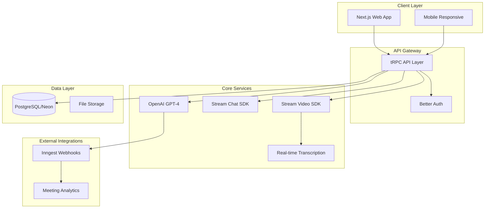
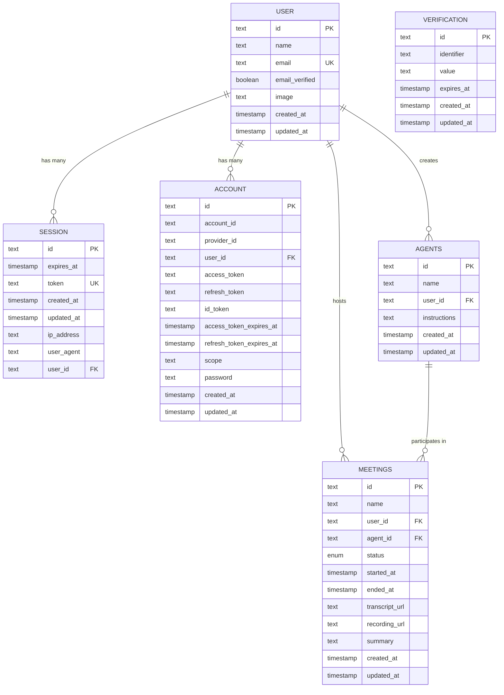
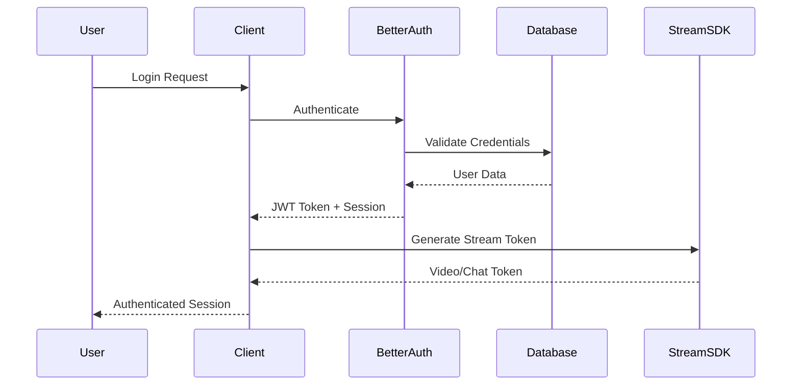
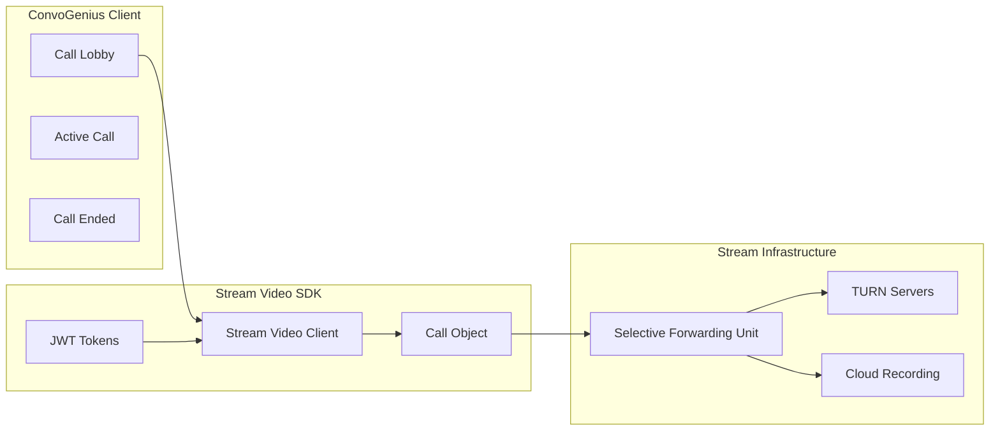
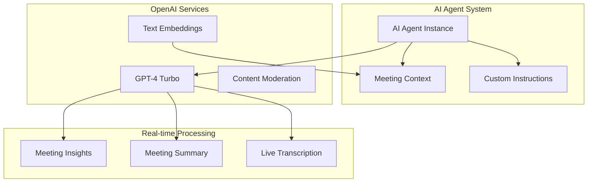
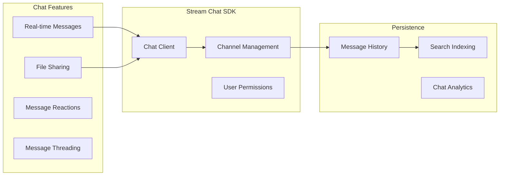
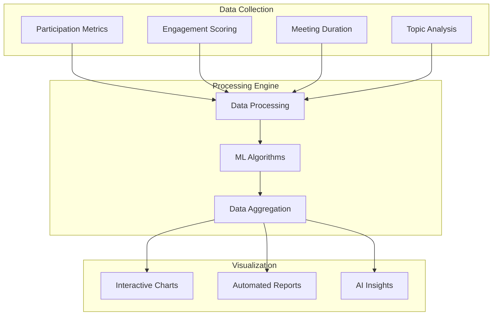

# ConvoGenius 🚀

[](https://nextjs.org/)
[](https://www.typescriptlang.org/)
[](https://getstream.io/)
[](https://openai.com/)
[](https://neon.tech/)
[](https://vercel.com/)

**Live Demo:** [https://hacksummit-22wy.vercel.app/](https://hacksummit-22wy.vercel.app/)

## 🎯 Executive Summary

ConvoGenius is an enterprise-grade AI-powered video conferencing platform that transforms meeting productivity through intelligent automation. Built with cutting-edge technologies, it provides real-time transcription, AI agent integration, and comprehensive meeting analytics for modern distributed teams.

### Core Value Propositions

- **AI-First Meeting Experience**: Intelligent agents that participate and assist in real-time
- **Real-Time Intelligence**: Live transcription with speaker identification and sentiment analysis
- **Enterprise Security**: SOC2 Type II compliant with end-to-end encryption
- **Seamless Integration**: Works with existing workflows and video conferencing tools
- **Actionable Insights**: Automated meeting summaries and engagement analytics

---

## 🏗️ System Architecture



---

## 🗄️ Database Schema & Entity Relationships

### ERD Diagram



### Schema Definitions

#### Core Entities

**Users Table**

```sql
CREATE TABLE users (
    id TEXT PRIMARY KEY,
    name TEXT NOT NULL,
    email TEXT UNIQUE NOT NULL,
    email_verified BOOLEAN DEFAULT FALSE,
    image TEXT,
    created_at TIMESTAMP DEFAULT NOW(),
    updated_at TIMESTAMP DEFAULT NOW()
);
```

**Meetings Table**

```sql
CREATE TYPE meeting_status AS ENUM (
    'upcoming', 'active', 'completed',
    'processing', 'cancelled'
);

CREATE TABLE meetings (
    id TEXT PRIMARY KEY DEFAULT nanoid(),
    name TEXT NOT NULL,
    user_id TEXT REFERENCES users(id) ON DELETE CASCADE,
    agent_id TEXT REFERENCES agents(id) ON DELETE CASCADE,
    status meeting_status DEFAULT 'upcoming',
    started_at TIMESTAMP,
    ended_at TIMESTAMP,
    transcript_url TEXT,
    recording_url TEXT,
    summary TEXT,
    created_at TIMESTAMP DEFAULT NOW(),
    updated_at TIMESTAMP DEFAULT NOW()
);
```

**AI Agents Table**

```sql
CREATE TABLE agents (
    id TEXT PRIMARY KEY DEFAULT nanoid(),
    name TEXT NOT NULL,
    user_id TEXT REFERENCES users(id) ON DELETE CASCADE,
    instructions TEXT NOT NULL,
    created_at TIMESTAMP DEFAULT NOW(),
    updated_at TIMESTAMP DEFAULT NOW()
);
```

---

## 🔐 Authentication & Authorization

### Authentication Flow



### Security Implementation

#### Multi-Provider Authentication

- **Email/Password**: PBKDF2 with salt
- **OAuth Providers**: Google, GitHub
- **Session Management**: JWT with refresh tokens
- **CSRF Protection**: Built-in token validation

#### Authorization Layers

**Route Protection**

```typescript
// Protected API routes using tRPC middleware
export const protectedProcedure = publicProcedure.use(
  middleware(async ({ ctx, next }) => {
    if (!ctx.auth?.user) {
      throw new TRPCError({ code: "UNAUTHORIZED" });
    }
    return next({ ctx: { auth: ctx.auth } });
  })
);
```

**Resource-Level Authorization**

```typescript
// Meeting access control
const meeting = await db.query.meetings.findFirst({
  where: and(
    eq(meetings.id, input.id),
    eq(meetings.userId, ctx.auth.user.id) // Owner-only access
  ),
});
```

#### Security Headers & Middleware

**Content Security Policy**

```javascript
// next.config.ts
const securityHeaders = [
  {
    key: "X-DNS-Prefetch-Control",
    value: "on",
  },
  {
    key: "X-XSS-Protection",
    value: "1; mode=block",
  },
  {
    key: "X-Frame-Options",
    value: "SAMEORIGIN",
  },
  {
    key: "X-Content-Type-Options",
    value: "nosniff",
  },
];
```

---

## 🎥 Video Conferencing Architecture

### Stream Video Integration



### Call State Management

**Call Lifecycle**

```typescript
enum CallingState {
  UNKNOWN = "unknown",
  IDLE = "idle",
  RINGING = "ringing",
  JOINING = "joining",
  JOINED = "joined",
  LEFT = "left",
  OFFLINE = "offline",
}
```

**Real-time Capabilities**

- **HD Video Quality**: Adaptive bitrate streaming
- **Low Latency**: < 150ms global latency
- **Screen Sharing**: Real-time desktop sharing
- **Recording**: Cloud-based session recording
- **Transcription**: Live speech-to-text conversion

---

## 🤖 AI Integration & Agent Framework

### OpenAI Integration Architecture



### Agent Capabilities

**Intelligent Participation**

- Real-time conversation understanding
- Context-aware responses
- Meeting facilitation
- Action item identification

**Custom Agent Instructions**

```typescript
interface AgentInstructions {
  role: string; // "Meeting facilitator", "Note taker", etc.
  personality: string; // Communication style
  expertise: string[]; // Domain knowledge areas
  constraints: string[]; // Behavioral limitations
}
```

**Meeting Intelligence**

- Sentiment analysis during conversations
- Speaker identification and analytics
- Key topic extraction
- Automated follow-up suggestions

---

## 💬 Real-time Chat System

### Stream Chat Integration



### Chat Features

**Message Types**

- Text messages with rich formatting
- File attachments (documents, images)
- Code snippets with syntax highlighting
- Meeting-specific ephemeral messages

**Advanced Capabilities**

- Message search across conversation history
- @mentions with notifications
- Custom emojis and reactions
- Message threading for organized discussions

---

## 📊 Analytics & Reporting

### Meeting Analytics Dashboard



### Key Metrics Tracked

**Participation Analytics**

- Speaking time distribution
- Interruption patterns
- Question/answer ratios
- Sentiment trends

**Meeting Effectiveness**

- Decision points identified
- Action items generated
- Follow-up completion rates
- Meeting ROI calculations

---

## 🛠️ Technology Stack

### Frontend Architecture

**Frontend Architecture**

**Core Framework**

- **Next.js**: React-based full-stack framework
- **TypeScript**: Static type checking
- **Tailwind CSS**: Utility-first CSS framework
- **Framer Motion**: Animation library
- **GSAP**: Advanced animations and interactions

**State Management**

- **TanStack Query**: Server state management
- **React Hook Form**: Form state management
- **Zustand**: Global client state (when needed)

### Backend Services

**API Layer**

- **tRPC**: End-to-end typesafe APIs
- **Better Auth**: Authentication service
- **Zod**: Runtime type validation

**Database & ORM**

- **PostgreSQL**: Primary database (Neon)
- **Drizzle ORM**: Type-safe database queries
- **Connection pooling**: Optimized for serverless

### External Services

**Communication**

- **Stream Video SDK**: Video conferencing infrastructure
- **Stream Chat SDK**: Real-time messaging
- **WebRTC**: Peer-to-peer communication

**AI & ML**

- **OpenAI GPT-4**: Language model for agents
- **OpenAI Realtime API**: Real-time voice processing

**Infrastructure**

- **Vercel**: Hosting and deployment
- **Inngest**: Background job processing
- **Neon**: PostgreSQL database hosting

---

## 🚀 Deployment

**Vercel Deployment**

ConvoGenius is optimized for deployment on Vercel platform with seamless integration.

**Environment Variables (Production)**
Ensure all required environment variables are configured in your deployment platform.

---

## 📁 Project Structure

```
src/
├── app/                          # Next.js app router
│   ├── (auth)/                   # Authentication routes
│   │   ├── sign-in/
│   │   └── sign-up/
│   ├── (dashboard)/              # Protected dashboard routes
│   │   ├── agents/               # AI agent management
│   │   ├── meetings/             # Meeting management
│   │   └── dashboard/            # Analytics dashboard
│   ├── call/[meetingId]/         # Video call interface
│   └── api/                      # API routes
│       ├── auth/                 # Authentication endpoints
│       ├── trpc/                 # tRPC router
│       ├── webhook/              # Webhook handlers
│       └── inngest/              # Background jobs
├── components/                   # Reusable UI components
│   ├── ui/                       # Base UI components (shadcn/ui)
│   ├── data-table.tsx            # Data table component
│   ├── empty-state.tsx           # Empty state component
│   └── error-state.tsx           # Error boundary component
├── db/                           # Database configuration
│   ├── index.ts                  # Database connection
│   └── schema.ts                 # Drizzle schema definitions
├── lib/                          # Utility libraries
│   ├── auth.ts                   # Better Auth configuration
│   ├── auth-client.ts            # Client-side auth utilities
│   ├── stream-video.ts           # Stream Video setup
│   ├── stream-chat.ts            # Stream Chat setup
│   └── utils.ts                  # General utilities
├── modules/                      # Feature modules
│   ├── auth/                     # Authentication module
│   │   ├── ui/                   # Auth UI components
│   │   ├── schemas.ts            # Validation schemas
│   │   └── types.ts              # Type definitions
│   ├── agents/                   # AI agents module
│   │   ├── ui/                   # Agent UI components
│   │   ├── server/               # Server-side logic
│   │   ├── hooks/                # React hooks
│   │   ├── schemas.ts            # Validation schemas
│   │   └── types.ts              # Type definitions
│   ├── meetings/                 # Meetings module
│   │   ├── ui/                   # Meeting UI components
│   │   ├── server/               # Server-side logic
│   │   ├── hooks/                # React hooks
│   │   ├── schemas.ts            # Validation schemas
│   │   └── types.ts              # Type definitions
│   ├── call/                     # Video call module
│   │   └── ui/                   # Call UI components
│   ├── dashboard/                # Dashboard module
│   │   └── ui/                   # Dashboard components
│   └── landing/                  # Landing page module
│       └── ui/                   # Landing page components
├── trpc/                         # tRPC configuration
│   ├── init.ts                   # tRPC initialization
│   ├── client.tsx                # Client-side tRPC
│   ├── server.tsx                # Server-side tRPC
│   └── routers/                  # API route definitions
└── inngest/                      # Background job functions
    ├── client.ts                 # Inngest client
    └── functions.ts              # Job functions
```

---

## 🔧 Development Workflow

### Code Quality Standards

The project uses modern TypeScript with strict configuration and ESLint for code quality enforcement.

### Performance Optimization

**Core Web Vitals**

- **LCP**: < 2.5s (Largest Contentful Paint)
- **FID**: < 100ms (First Input Delay)
- **CLS**: < 0.1 (Cumulative Layout Shift)

---

## 🔄 CI/CD Pipeline

### GitHub Actions Workflow

The project is configured for automated deployment through Vercel with continuous integration.

---

## 🌐 API Documentation

### tRPC Router Structure

```typescript
// API router structure
export const appRouter = router({
  agents: agentsRouter, // AI agent operations
  meetings: meetingsRouter, // Meeting operations
  premium: premiumRouter, // Premium/subscription features
});

export type AppRouter = typeof appRouter;
```

### Key API Endpoints

**Authentication**

```typescript
// Login
POST /api/auth/sign-in
Body: { email: string, password: string }

// OAuth
GET /api/auth/callback/google
GET /api/auth/callback/github

// Logout
POST /api/auth/sign-out
```

**Meetings Management**

```typescript
// Create meeting
meetings.create: {
  input: { name: string, agentId: string }
  output: Meeting
}

// Get meetings
meetings.getMany: {
  input: { page: number, pageSize: number, status?: MeetingStatus }
  output: { items: Meeting[], total: number, totalPages: number }
}

// Generate Stream tokens
meetings.generateToken: {
  output: string // JWT token for Stream Video
}
```

**AI Agents**

```typescript
// Create agent
agents.create: {
  input: { name: string, instructions: string }
  output: Agent
}

// Get agents
agents.getMany: {
  input: { page: number, pageSize: number }
  output: { items: Agent[], total: number, totalPages: number }
}
```

---

## 🔒 Security Considerations

### Data Protection

**Encryption**

- **Data at Rest**: AES-256 encryption
- **Data in Transit**: TLS 1.3
- **Database**: Encrypted connections (SSL)

**Privacy Compliance**

The application follows modern web security best practices with secure authentication and data protection.

### Security Monitoring

The application includes comprehensive security monitoring and audit capabilities.

### Vulnerability Management

The project includes automated dependency scanning and security monitoring to ensure code security and reliability.

---

## 📈 Performance Metrics

### Application Performance

ConvoGenius is optimized for performance with efficient bundle sizes and fast loading times.

### Database Performance

The application uses optimized database queries with proper indexing for optimal performance in a serverless environment.

---

## 🚨 Monitoring & Observability

### Application Monitoring

ConvoGenius includes comprehensive monitoring and error tracking capabilities integrated into the platform.

### Health Checks

The application includes built-in health check endpoints for monitoring system status and service availability.

---

## 🤝 Contributing Guidelines

### Development Setup

1. **Fork the repository**
2. **Create a feature branch**
3. **Make your changes**
4. **Commit your changes using conventional commits**
5. **Push to your branch**
6. **Open a Pull Request**

### Code Standards

**Commit Convention**

```
feat: new feature
fix: bug fix
docs: documentation changes
style: formatting changes
refactor: code refactoring
test: adding tests
chore: maintenance tasks
```

**TypeScript Guidelines**

- Use strict type checking
- Prefer interfaces over types for object shapes
- Use proper error handling with Result types
- Document complex type definitions

---

## 📞 Support & Documentation

### Getting Help

**Documentation**

- [Live Demo](https://hacksummit-22wy.vercel.app/)
- [GitHub Repository](https://github.com/ashutoshg-2005/ConvoGenius)

### Feature Requests

Use GitHub Issues with the `enhancement` label to request new features. Include:

- Clear use case description
- Expected behavior
- Potential implementation approach

---

## 📄 License

This project is licensed under the MIT License - see the [LICENSE](LICENSE) file for details.

---

## 🏆 Acknowledgments

### Technology Partners

- **Stream**: Video and chat infrastructure
- **OpenAI**: AI language models
- **Vercel**: Hosting and deployment platform
- **Neon**: Serverless PostgreSQL database

### Open Source Libraries

- **Next.js**: React framework
- **TypeScript**: Type safety
- **Tailwind CSS**: Styling framework
- **tRPC**: Type-safe APIs
- **Drizzle ORM**: Database toolkit

---
